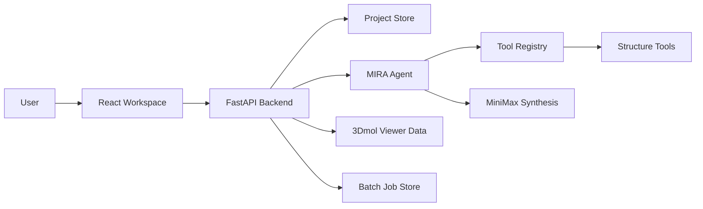

# MIRA Demo Video Guide

This guide is designed for a 3 minute class-project demo video. It maps
directly to the required questions and gives a practical recording path through
the hosted product.

## Core Message

MIRA is a molecular reasoning workspace for protein structure analysis and early
de novo design triage. The bottleneck it addresses is not the lack of structure
prediction tools. The bottleneck is that researchers can generate many candidate
structures, but filtering, interpreting, ranking, and explaining them still
requires jumping between scripts, viewers, notebooks, and manual notes.

MIRA connects those pieces:

- a project workspace for targets, designs, batches, and reports;
- an agentic chat interface that can run structure-analysis tools;
- a 3D structure viewer with clickable residue evidence;
- batch ranking over local PDB/CIF/mmCIF structures;
- synthesis reports from an LLM provider;
- a CLI agent plus a small reasoning eval harness.

Recommended title:

> MIRA: A Molecular Intelligence and Reasoning Agent for Protein Design Triage

## Video Shape

Target length: 3:00.

| Time | Segment | Main Question |
| --- | --- | --- |
| 0:00-0:25 | Problem and motivation | Q1 |
| 0:25-0:55 | What MIRA is | Q1/Q2 |
| 0:55-1:55 | Product demo | Q2 |
| 1:55-2:25 | Architecture and eval | Q2 |
| 2:25-2:45 | Use cases and impact | Q3 |
| 2:45-3:00 | What comes next | Q4 |

## Recording Prep

Before recording:

1. Open the hosted app: `http://143.198.231.169`
2. Hard refresh the browser.
3. Keep one local file ready for upload:
   - `tests/data/batch/1ubq.pdb`
   - `tests/data/local/mini_complex.pdb`
4. Keep the CLI eval report command ready:

```bash
cd <repo-root>
venv/bin/python scripts/run_cli_reasoning_eval.py --mode live --provider minimax --limit 36
```

5. For the live eval result, use the already-generated report if needed:

```bash
cat eval-results/cli-reasoning-minimax-36/summary.json
```

If model calls are slow during recording, do not wait silently. Say:

> The live synthesis call can take a few seconds, so for the demo I am showing a
> completed project state and the eval report from the same agent.

## Shot List

### Shot 1: Opening Problem

Visual:

- Start on the MIRA project home page or a clean title slide.

Narration:

> I built MIRA because protein design is becoming very high-throughput, but the
> reasoning layer around it is still fragmented. A model or design pipeline can
> produce many candidate structures, but deciding which ones are promising still
> means manually checking interfaces, exposed residues, B-factors, residue
> contacts, and then writing up the reasoning. That is slow, repetitive, and
> easy to make inconsistent.

### Shot 2: Product Overview

Visual:

- Show the Projects page.
- Point out project folders, chat, workspace, and structure inspector.

Narration:

> MIRA is a structure-reasoning workspace. Each project keeps a target structure,
> chat history, generated candidates, batch jobs, ranked results, downloaded
> outputs, and reports together. The goal is to let a user move from target
> analysis, to candidate generation, to batch filtering, to evidence-backed
> synthesis without changing tools.

### Shot 3: Create/Open Project

Visual:

- Open an existing project, or create one named `Ubiquitin design triage`.
- Upload `1ubq.pdb` as the target if needed.

Narration:

> Here I am opening a project and attaching a protein structure. The important
> design choice is that local PDB files are first-class. MIRA does not need to
> download from RCSB when a researcher is working with private or de novo
> structures.

### Shot 4: Chat Analysis

Visual:

- Go to Chat.
- Ask:

```text
Analyze this target structure. Identify stable regions, flexible regions, and any residue-level evidence worth considering for design.
```

- If a completed answer exists, show it.
- Click a residue or evidence link if present.

Narration:

> The chat is not just a generic chatbot. It is connected to project context and
> to structure-analysis tools. The agent can load the structure, run analyses
> like SASA, B-factors, Ramachandran checks, contacts, and interface calculations,
> then synthesize the result in biological language. When the report references
> a residue or region, the link can drive the viewer on the right.

### Shot 5: 3D Viewer and Evidence

Visual:

- Show the right-side 3D viewer.
- Click evidence labels.
- Show sidechain/stick highlighting rather than large spheres.

Narration:

> A key product decision was to put the molecular viewer next to the reasoning
> instead of separating them. The user can read the explanation and immediately
> inspect the structural evidence. This matters because a design recommendation
> is only useful if you can see what part of the molecule it is talking about.

### Shot 6: Workspace and Outputs

Visual:

- Go to Workspace.
- Show project structures, design runs, sequence runs, and download buttons.
- If generated structures are present, select one and show it in the viewer.
- Show `Outputs` ZIP and `FASTA` download actions.

Narration:

> The workspace is where generated designs and batch results live. It acts like
> a project folder inside the app. Generated structures and sequences can be
> downloaded, and selecting a candidate updates the viewer and metrics. This
> makes the batch page less like a one-off result screen and more like an
> evolving design workspace.

### Shot 7: Batch Filtering

Visual:

- Show a batch or candidate ranking.
- If running live, use a small batch. If not, show an existing completed result.
- Show ranked metrics and synthesis report.

Narration:

> The batch mode is the core baseline. MIRA can analyze a local folder of PDB,
> CIF, or mmCIF files, execute a shared plan over each structure, extract
> comparable metrics, rank candidates, and generate a synthesis report. For
> de novo design, this is useful because the first question is usually not
> "which structure is perfect?" It is "which candidates are worth deeper
> computational or wet-lab follow-up?"

### Shot 8: Architecture

Visual:

- Show a simple architecture slide or scroll this diagram.



Narration:

> For the application track, the research contribution is in the system design
> rather than training a new foundation model. The frontend is a React workspace.
> The backend is FastAPI on a DigitalOcean droplet. Project and job state are
> persisted server-side. The agent uses a planning-first loop: create a plan,
> validate it against registered tools and structure context, execute tools
> deterministically, and then synthesize the results with MiniMax. The same core
> agent also exists as a CLI.

### Shot 9: CLI Reasoning Eval

Visual:

- Show terminal output from:

```bash
venv/bin/python scripts/run_cli_reasoning_eval.py --mode live --provider minimax --limit 36
```

- Or show the JSON summary:

```text
cli_smoke_passed: true
eval_cases: 36
pass_rate: 91.7%
mean_tool_recall: 84.2%
schema_valid_plans: 97.2%
min_score: 1.0
```

Narration:

> To avoid only showing a polished demo, I also added a CLI reasoning
> eval. It checks that the CLI commands parse, then runs live planning cases
> over local structure fixtures. The score measures whether the agent selected
> the required tools, used local file paths, executed the tools successfully,
> and grounded the final answer in expected structural evidence. This is not a
> full benchmark, but it is a transparent readiness check for the agent layer.

### Shot 10: Use Cases and Impact

Visual:

- Return to the workspace with viewer/report visible.

Narration:

> The main use case is early-stage protein design triage. A researcher could
> point MIRA at a folder of candidate binders, inspect the top-ranked structures,
> and get an evidence-backed explanation of why certain designs look promising
> or risky. It could also help students learn structural biology because the
> explanation is tied directly to visual residue evidence. More broadly, tools
> like this can make computational biology workflows more accessible, more
> reproducible, and faster to iterate.

### Shot 11: What More Would You Add?

Visual:

- Show workspace or architecture diagram.

Narration:

> The next layer would be stronger design-model integration. Right now the app
> can route CPU-friendly generation and sequence-design jobs, and the architecture
> is ready for GPU-backed tools. I would add RFdiffusion or BindCraft workers for
> target-conditioned binder design, Cloudflare inference for cheaper synthesis,
> richer scientific evals against known structures, and more automatic design
> loops where MIRA proposes, generates, filters, and explains candidates.

## One-Take Script

Use this if you want a simple narration without thinking about section cuts.

> I built MIRA because protein design workflows are becoming high-throughput, but
> the reasoning layer is still surprisingly manual. A design model can create
> many candidate structures, but deciding which ones are actually worth looking
> at requires checking interfaces, solvent exposure, B-factors, contacts, and
> residue-level evidence across several tools. MIRA tries to make that process
> feel like one workspace.
>
> This project is on the application track. I did not train a new foundation
> model. Instead, I built a product around a planning-first molecular reasoning
> agent. The frontend is a React workspace with projects, chat, a batch/design
> workspace, and a 3D structure viewer. The backend is FastAPI deployed on a
> DigitalOcean droplet. The agent creates a plan, validates the plan against
> registered structure-analysis tools, executes those tools deterministically,
> and then uses MiniMax to synthesize a report.
>
> In the app, I can open a project, attach a target PDB, and ask the chat to
> analyze it. The agent can run tools like structure loading, SASA, B-factor
> analysis, Ramachandran checks, contacts, and interface calculations. The key
> point is that the output is not only text. The structure viewer sits next to
> the report, and evidence links can highlight the referenced residue regions.
>
> From the same project, I can move into the workspace and inspect generated
> structures, sequence designs, batch jobs, reports, and downloads. The batch
> workflow is especially important for de novo design because candidate folders
> are local and often private. MIRA supports local PDB, CIF, and mmCIF inputs,
> ranks structures by metrics like stability, buried surface area, interface
> residue count, and B-factors, and produces a comparative synthesis report.
>
> I also added a CLI reasoning eval. It checks CLI parsing and runs live
> MiniMax planning cases across active sites, interfaces, stability, allostery,
> homology, and design. It scores expected tool coverage, precision,
> schema-valid arguments, and planning latency. This gives me a transparent
> sanity check that the agent is doing more than producing a nice-looking answer.
>
> The use case is early protein design triage. A researcher could generate many
> candidate binders, load them into MIRA, quickly identify promising structures,
> and understand the structural evidence behind that ranking. This could also
> help students learn structural biology because the reasoning is linked to the
> molecule itself. Longer-term, I would add GPU-backed RFdiffusion or BindCraft
> workers, cheaper Cloudflare inference, stronger scientific benchmarks, and a
> more autonomous loop that proposes, generates, filters, and explains new
> protein designs.

## Q1-Q4 Answer Map

### Q1: Why did you build what you did?

Answer:

- Protein design can generate many structures, but filtering them is manual.
- Existing workflows split across scripts, molecular viewers, notebooks, and
  written reports.
- The inspiration was to make an agent that can reason over actual structure
  files, not just talk about proteins abstractly.

Key phrase:

> The bottleneck is turning many candidate structures into a ranked,
> evidence-backed design decision.

### Q2: How exactly does the product work?

Use the application/product track framing:

- React frontend: projects, chat, workspace, 3D viewer.
- FastAPI backend on DigitalOcean.
- Server-side project/job storage.
- MiniMax for synthesis.
- Planning-first `MiraAgent`.
- Tool registry for deterministic structural analysis.
- Batch execution over local PDB/CIF/mmCIF folders.
- CLI reasoning eval validates the agent layer.

Important wording:

> I did not train a new foundation model for this version. The product combines
> existing LLM inference with deterministic structural biology tools and a
> persistent design workspace.

### Q3: Potential use cases and impact

Use cases:

- Early triage of de novo binders.
- Structure quality review before expensive GPU or wet-lab follow-up.
- Teaching structural biology with visual evidence.
- Faster comparison of candidate designs.
- Reproducible project reports for computational biology teams.

Impact:

- Speeds up iteration.
- Reduces manual analysis burden.
- Makes expert-style structure reasoning easier to access.
- Helps prioritize candidates before costly experiments.

### Q4: What more would you add?

Next additions:

- GPU-backed RFdiffusion or BindCraft workers.
- ProteinMPNN/LigandMPNN sequence-design loops with richer filtering.
- Cloudflare inference when credits are approved.
- More robust evals against curated known structures.
- Better autonomous loops: target analysis, design generation, ranking,
  synthesis, and next-round mutation suggestions.
- Collaboration features for lab notebooks and project sharing.

## Backup Plan For Recording

If the live app is slow:

1. Show the project page and explain the flow.
2. Use an existing completed project for chat/report/viewer shots.
3. Show the eval JSON summary in terminal.
4. Mention that live LLM synthesis is provider-latency dependent.

If the viewer is blank:

1. Select a known target structure from Project structures.
2. Hard refresh the page.
3. Say:

> The viewer is loading a structure file from the project store. The same
> structure is also available as a downloadable PDB in the workspace.

If design generation is not configured:

> The current hosted CPU backend is for the product prototype and small local
> jobs. The architecture already routes design jobs, but real target-conditioned
> binder generation should run on a GPU worker.

## Final Submission Checklist

- Show the product, not only slides.
- Say clearly that this is application/product track.
- Do not overclaim model training.
- Mention the CLI eval result as a transparent sanity check.
- Show at least one structure in the viewer.
- Show at least one evidence/report connection.
- Show the workspace/downloads.
- End with what GPU-backed design generation would unlock.
